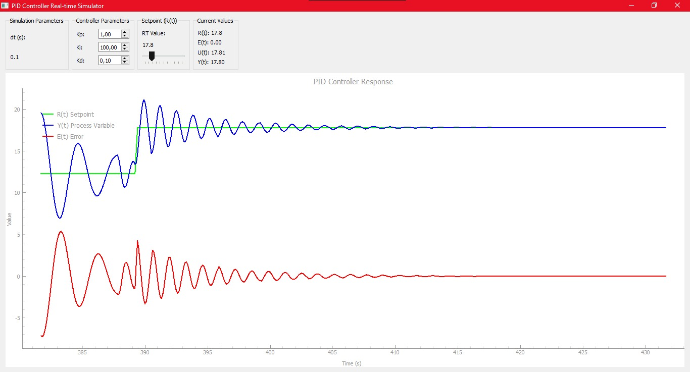

# realtime-simulator-pid-controller
Python-based real-time PID Controller simulator, tunning the proporsional, integral, and derivative variabel to see the difference has made in time series.
Web-based found here: https://pidcontroller.streamlit.app/
Desktop-based found here: 

## Overview

A **PID (Proportional, Integral, Derivative)** controller is a widely used control loop feedback mechanism. It is designed to maintain a system's desired output by adjusting control inputs based on three distinct terms: Proportional (P), Integral (I), and Derivative (D).

- **Proportional (P):** This term determines the reaction to the current error. A higher proportional gain leads to a faster response but can result in overshooting or instability if set too high.
- **Integral (I):** This term accounts for the accumulated error over time. It helps eliminate steady-state error but may introduce oscillations if set too high.
- **Derivative (D):** This term predicts the future error, based on the rate of change. It helps reduce overshooting and improves stability by responding to the rate of error change.

By experimenting with the values of **P**, **I**, and **D**, users can tune the controller to achieve optimal system performance. 

## Watch the Demo

Check out the demo of the PID controller simulator in action here:  

## Experiment and Tune

You can start experimenting with different PID parameters directly on the platform. Fine-tuning the system will help you understand how each parameter (P, I, D) affects the system's stability and performance.

Feel free to explore the code and modify the parameters to observe how the system behaves with different settings.
